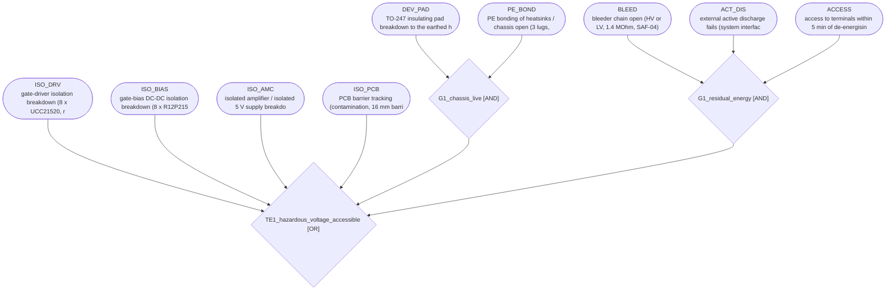
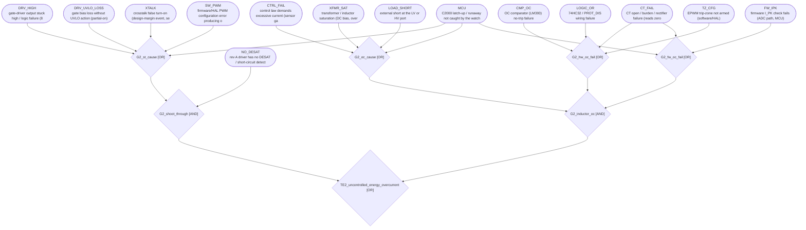
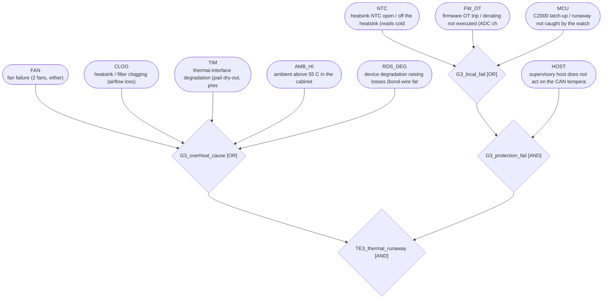

# Fault trees (Mermaid, generated by fta.py)

```mermaid
graph TD
  TE1_hazardous_voltage_accessible{"TE1_hazardous_voltage_accessible [OR]"}
  ISO_DRV(["ISO_DRV<br/>gate-driver isolation breakdown (8 x UCC21520, r"])
  ISO_DRV --> TE1_hazardous_voltage_accessible
  ISO_BIAS(["ISO_BIAS<br/>gate-bias DC-DC isolation breakdown (8 x R12P215"])
  ISO_BIAS --> TE1_hazardous_voltage_accessible
  ISO_AMC(["ISO_AMC<br/>isolated amplifier / isolated 5 V supply breakdo"])
  ISO_AMC --> TE1_hazardous_voltage_accessible
  ISO_PCB(["ISO_PCB<br/>PCB barrier tracking (contamination, 16 mm barri"])
  ISO_PCB --> TE1_hazardous_voltage_accessible
  G1_chassis_live{"G1_chassis_live [AND]"}
  DEV_PAD(["DEV_PAD<br/>TO-247 insulating pad breakdown to the earthed h"])
  DEV_PAD --> G1_chassis_live
  PE_BOND(["PE_BOND<br/>PE bonding of heatsinks / chassis open (3 lugs, "])
  PE_BOND --> G1_chassis_live
  G1_chassis_live --> TE1_hazardous_voltage_accessible
  G1_residual_energy{"G1_residual_energy [AND]"}
  BLEED(["BLEED<br/>bleeder chain open (HV or LV, 1.4 MOhm, SAF-04)"])
  BLEED --> G1_residual_energy
  ACT_DIS(["ACT_DIS<br/>external active discharge fails (system interfac"])
  ACT_DIS --> G1_residual_energy
  ACCESS(["ACCESS<br/>access to terminals within 5 min of de-energisin"])
  ACCESS --> G1_residual_energy
  G1_residual_energy --> TE1_hazardous_voltage_accessible
```

```mermaid
graph TD
  TE2_uncontrolled_energy_overcurrent{"TE2_uncontrolled_energy_overcurrent [OR]"}
  G2_shoot_through{"G2_shoot_through [AND]"}
  G2_st_cause{"G2_st_cause [OR]"}
  DRV_HIGH(["DRV_HIGH<br/>gate-driver output stuck high / logic failure (8"])
  DRV_HIGH --> G2_st_cause
  DRV_UVLO_LOSS(["DRV_UVLO_LOSS<br/>gate bias loss without UVLO action (partial-on)"])
  DRV_UVLO_LOSS --> G2_st_cause
  XTALK(["XTALK<br/>crosstalk false turn-on (design-margin event, se"])
  XTALK --> G2_st_cause
  SW_PWM(["SW_PWM<br/>firmware/HAL PWM configuration error producing o"])
  SW_PWM --> G2_st_cause
  MCU(["MCU<br/>C2000 latch-up / runaway not caught by the watch"])
  MCU --> G2_st_cause
  G2_st_cause --> G2_shoot_through
  NO_DESAT(["NO_DESAT<br/>rev A driver has no DESAT / short-circuit detect"])
  NO_DESAT --> G2_shoot_through
  G2_shoot_through --> TE2_uncontrolled_energy_overcurrent
  G2_inductor_oc{"G2_inductor_oc [AND]"}
  G2_oc_cause{"G2_oc_cause [OR]"}
  CTRL_FAIL(["CTRL_FAIL<br/>control law demands excessive current (sensor ga"])
  CTRL_FAIL --> G2_oc_cause
  XFMR_SAT(["XFMR_SAT<br/>transformer / inductor saturation (DC bias, over"])
  XFMR_SAT --> G2_oc_cause
  LOAD_SHORT(["LOAD_SHORT<br/>external short at the LV or HV port"])
  LOAD_SHORT --> G2_oc_cause
  MCU(["MCU<br/>C2000 latch-up / runaway not caught by the watch"])
  MCU --> G2_oc_cause
  G2_oc_cause --> G2_inductor_oc
  G2_hw_oc_fail{"G2_hw_oc_fail [OR]"}
  CMP_OC(["CMP_OC<br/>OC comparator (LM393) no-trip failure"])
  CMP_OC --> G2_hw_oc_fail
  CT_FAIL(["CT_FAIL<br/>CT open / burden / rectifier failure (reads zero"])
  CT_FAIL --> G2_hw_oc_fail
  LOGIC_OR(["LOGIC_OR<br/>74HC32 / PROT_DIS wiring failure"])
  LOGIC_OR --> G2_hw_oc_fail
  TZ_CFG(["TZ_CFG<br/>EPWM trip-zone not armed (software/HAL)"])
  TZ_CFG --> G2_hw_oc_fail
  G2_hw_oc_fail --> G2_inductor_oc
  G2_fw_oc_fail{"G2_fw_oc_fail [OR]"}
  FW_IPK(["FW_IPK<br/>firmware I_PK check fails (ADC path, MCU)"])
  FW_IPK --> G2_fw_oc_fail
  CT_FAIL(["CT_FAIL<br/>CT open / burden / rectifier failure (reads zero"])
  CT_FAIL --> G2_fw_oc_fail
  MCU(["MCU<br/>C2000 latch-up / runaway not caught by the watch"])
  MCU --> G2_fw_oc_fail
  G2_fw_oc_fail --> G2_inductor_oc
  G2_inductor_oc --> TE2_uncontrolled_energy_overcurrent
```

```mermaid
graph TD
  TE3_thermal_runaway{"TE3_thermal_runaway [AND]"}
  G3_overheat_cause{"G3_overheat_cause [OR]"}
  FAN(["FAN<br/>fan failure (2 fans, either)"])
  FAN --> G3_overheat_cause
  CLOG(["CLOG<br/>heatsink / filter clogging (airflow loss)"])
  CLOG --> G3_overheat_cause
  TIM(["TIM<br/>thermal-interface degradation (pad dry-out, pres"])
  TIM --> G3_overheat_cause
  AMB_HI(["AMB_HI<br/>ambient above 55 C in the cabinet"])
  AMB_HI --> G3_overheat_cause
  RDS_DEG(["RDS_DEG<br/>device degradation raising losses (bond-wire fat"])
  RDS_DEG --> G3_overheat_cause
  G3_overheat_cause --> TE3_thermal_runaway
  G3_protection_fail{"G3_protection_fail [AND]"}
  G3_local_fail{"G3_local_fail [OR]"}
  NTC(["NTC<br/>heatsink NTC open / off the heatsink (reads cold"])
  NTC --> G3_local_fail
  FW_OT(["FW_OT<br/>firmware OT trip / derating not executed (ADC ch"])
  FW_OT --> G3_local_fail
  MCU(["MCU<br/>C2000 latch-up / runaway not caught by the watch"])
  MCU --> G3_local_fail
  G3_local_fail --> G3_protection_fail
  HOST(["HOST<br/>supervisory host does not act on the CAN tempera"])
  HOST --> G3_protection_fail
  G3_protection_fail --> TE3_thermal_runaway
```
